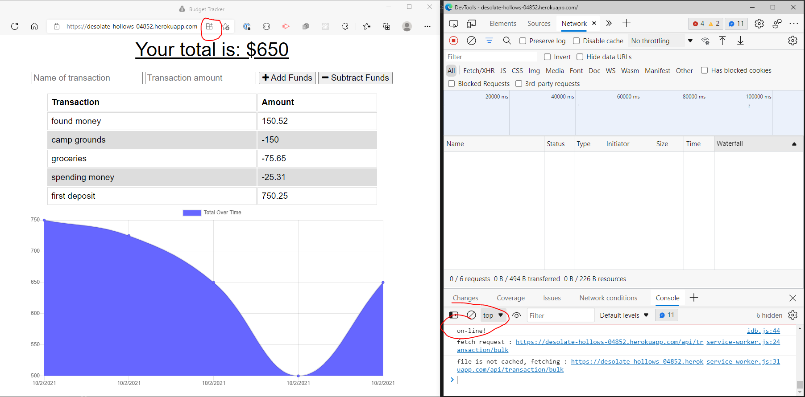
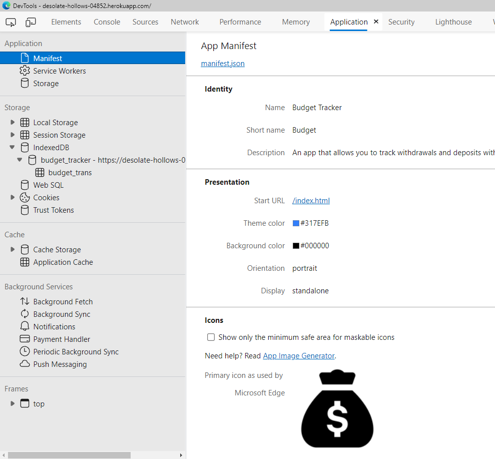
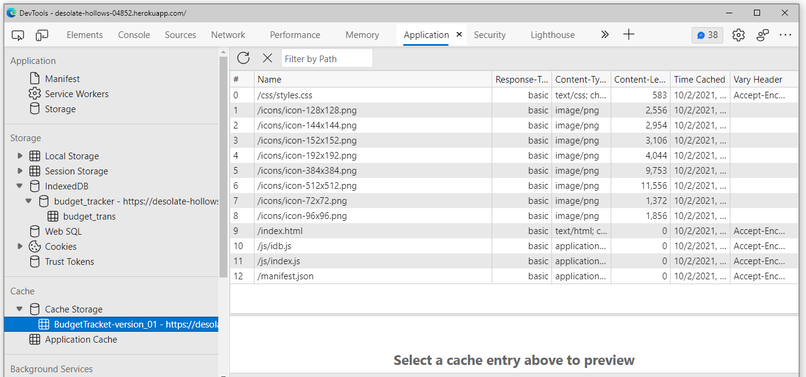
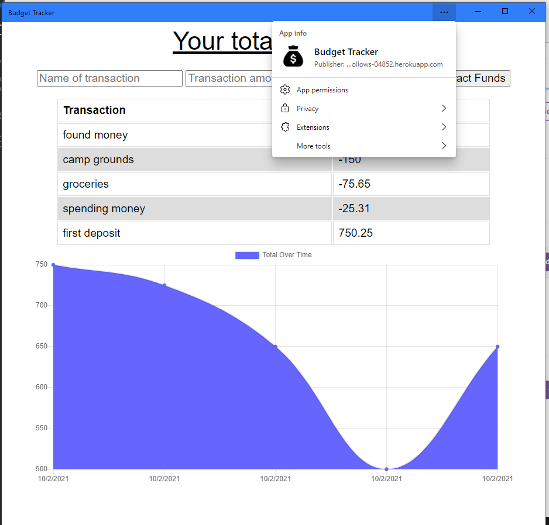
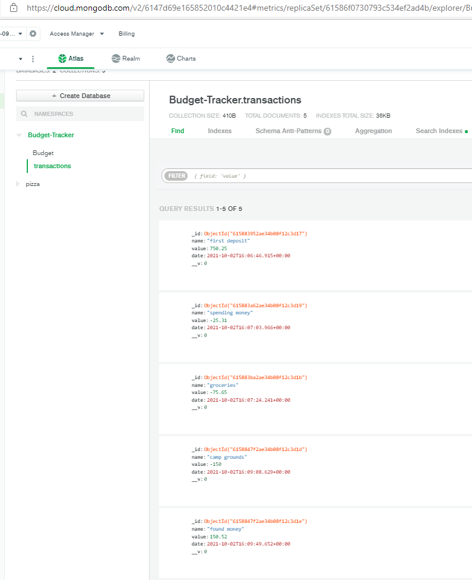

# 19 Progressive Web Applications (PWA) Challenge: Budget Tracker

## Author: Rob Ellingson
- Source: [Github](https://github.com/awolrob/budget-tracker) `https://github.com/awolrob/budget-tracker`
- Deployed Site: [Heroku](https://desolate-hollows-04852.herokuapp.com/) `https://desolate-hollows-04852.herokuapp.com/`

```md
AS AN avid traveler
I WANT to be able to track my withdrawals and deposits with or without a data/internet connection
SO THAT my account balance is accurate when I am traveling 
```

```md
GIVEN a Budget Tracker without an internet connection
WHEN the user inputs an expense or deposit
THEN they will receive a notification that they have added an expense or deposit
WHEN the user reestablishes an internet connection
THEN the deposits or expenses added while they were offline are added to their transaction history and their totals are updated
```

## Install

Express
```
npm install express
```
Mongoose
```
npm install mongoose
```
Morgan
```
npm install morgan
```
Compression
```
npm install compression
```

## Production Environment:

1) Create Production Database in Atlas
   * create database name space in Atlas (my result: Budget-Tracker.Budget)

2) Deploy to heroku and set up Mongo Atlas environment variable in heroku
    * in gitbash cli
    * heroku create (my result - https://desolate-hollows-04852.herokuapp.com/ )
    Note: In heroku - add MongoDB Atlas environment variables

    * git add -A
    * git push heroku main
    * heroku open

## Mock-Up
The following animation demonstrates the application functionality:


## Run
* Open ( https://desolate-hollows-04852.herokuapp.com/ ) in your browser.

## Final Pages
The following images were generated using the application:

- Offline transactions


- Working Manifest


- Working Cache


- PWA Installed


- MongoDB Atlas Database updated with on-line and off-line transactions


- - -
` https://github.com/awolrob | 2021-10-02 ` 